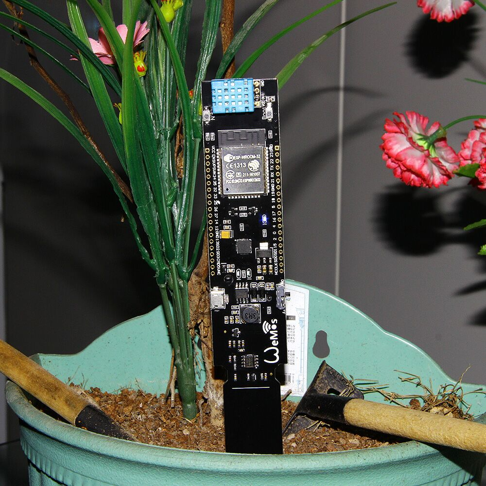
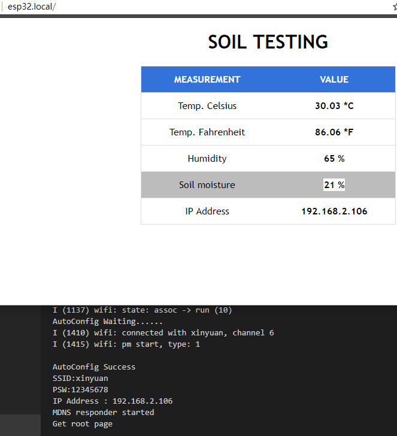

# Soil-testing example

### Install the following library support:
[DHT-sensor-library](https://github.com/adafruit/DHT-sensor-library)

Step:
- Compile with Arduino IED, burn to board
- For the first time you need to use [SmartConfig Android](https://play.google.com/store/apps/details?id=com.cmmakerclub.iot.esptouch) or [Esptouch](https://www.espressif.com/en/products/software/esp-touch/resources)for wifi setup
- Enter http://esp32.local in the browser and you will see the following image

